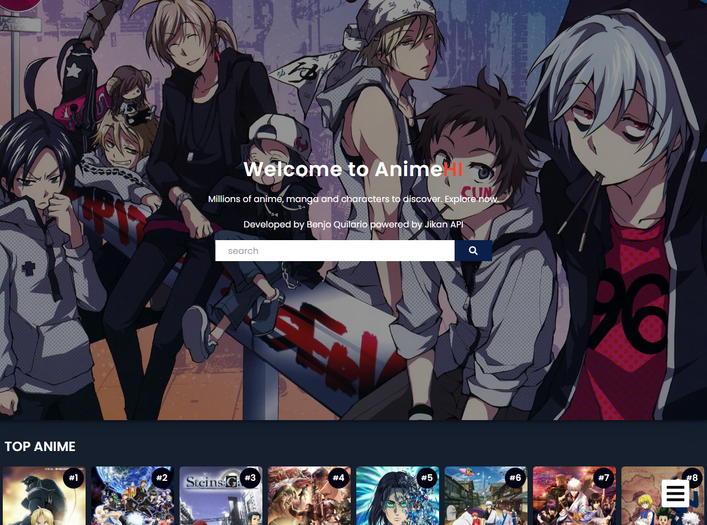
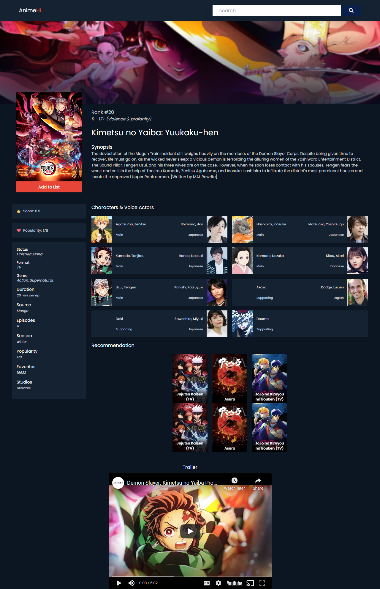

<h4 align="center">An Web application for a simple and usefull anime information.</h4>

## Screenshots

## Description

AnimeHi a connected api website, powered by JikanAPIv4

### Features

-  Search Anime
-  Suggestion keyword search
-  Top Animes
-  Anime Movies
-  Watch Progress
-  Add To Plan To Watch
-  Add to completed anime
-  Dark Mode Support with system

### Coming Features

-  Different list of Manga/ Character / People
-  Episodes for anime info
-  … and many more

## Contribution

Your ideas, translations, design changes, code cleaning, real heavy code changes, or any help are always welcome. The more is the contribution, the better it gets.

[Pull requests](https://github.com/benjoquilario/animehi/pulls) will be reviewed

## Built with

-  [Reach JS](https://reactjs.org/)
-  [Tailwind CSS](https://tailwindcss.com/): for designing the components
-  [Context API](https://reactjs.org/docs/context.html): for state management
-  [Jikan API](https://docs.api.jikan.moe/): for Content
-  [React Slick](https://react-slick.neostack.com/): for carousel
-  [react-debounce-input](https://www.npmjs.com/package/react-debounce-input): for debouncing search input
-  [Netlify](https://www.netlify.com/): for hosting

## Author

### Benjo M. Quilario

-  Portfolio: [BenjoQuilario](https://benjoquilario.me/)
-  Twitter: [@iambenjo](https://twitter.com/iam_benjo)
-  Github: [@benjoquilario](https://github.com/benjoquilario)
